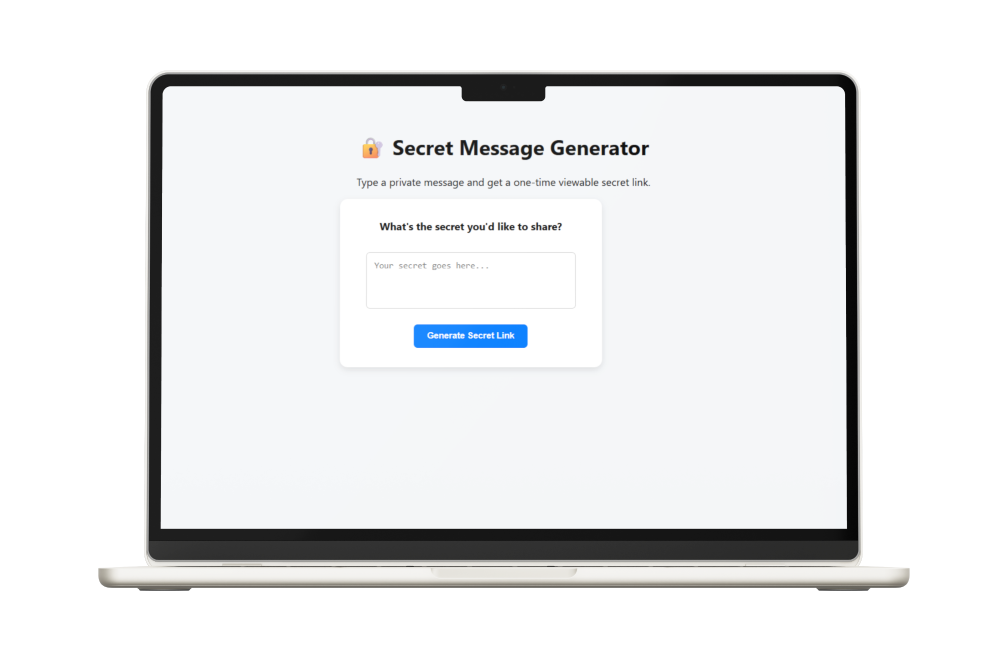

# Secret Message App

A PHP & MySQL powered web app to create self-destructing secret messages with one-time secure links.

## Features
- Generate secret messages that can only be viewed once
- Messages automatically expire after 24 hours
- Unique token links for each message
- Simple, clean UI

## Technologies
- PHP
- MySQL
- HTML5 & CSS3
- Apache (XAMPP or similar local server)

## Usage
- Enter your secret message and submit.
- Copy the generated link and share it securely.
- When the recipient opens the link, the message is revealed and then deleted.

## Learning Notes
This project helped me understand:
- Secure database interactions with prepared statements
- Handling URL parameters safely
- Implementing time-based cleanup logic in SQL
- Frontend-backend integration using PHP and MySQL

## 🖼️ Preview

